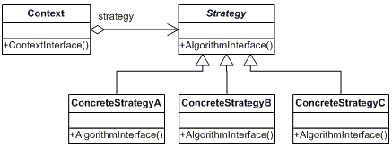

# 디자인 패턴 - 전략 패턴(Strategy Pattern)

## 개념

- **종류:** 행위 패턴
- **정의:** 알고리즘(행동)을 캡슐화하여, 런타임에 알고리즘을 선택하거나 교체할 수 있게 하는 패턴
- **활용**
  - 조건문으로 알고리즘을 분기하는 코드가 많을 때
  - 실행 중에 알고리즘을 변경할 필요가 있을 때
  - 정책(Policy), 계산 로직 등을 교체 가능하게 만들고 싶을 때

## 구조

| 역할                | 설명                                                                   |
| ------------------- | ---------------------------------------------------------------------- |
| Strategy(Interface) | 공통된 동작(알고리즘)을 정의하는 인터페이스                            |
| ConcreteStrategy    | Strategy 인터페이스를 구현한 구체적인 알고리즘 클래스                  |
| Context             | Strategy를 사용하는 클래스. 클라이언트로부터 전략을 받아 동작을 위임함 |



## 장점 / 단점

- **장점:** 조건문 제거, 알고리즘 교체 용이, 개방-폐쇄 원칙(OCP) 준수
- **단점:** 객체 수 증가, 클라이언트가 전략 클래스를 이해해야 함

## 예시 코드

결제 시스템에서 결제 방식을 전략으로 분리하여, 런타임에 신용카드/카카오페이/네이버페이 등으로 교체할 수 있도록 함

```
📂 strategy-example
 ┣ 📜 PaymentStrategy.java        ← Strategy 인터페이스
 ┣ 📜 CreditCardPayment.java      ← ConcreteStrategy
 ┣ 📜 KakaoPayPayment.java        ← ConcreteStrategy
 ┣ 📜 PaymentContext.java         ← Context
 ┗ 📜 Main.java                   ← Client
```

### Client

```java
public class Main {
    public static void main(String[] args) {
        PaymentContext context = new PaymentContext();

        context.setPaymentStrategy(new CreditCardPayment());
        context.pay(10000);

        context.setPaymentStrategy(new KakaoPayPayment());
        context.pay(15000);
    }
}
```

### Strategy(Interface)

```java
public interface PaymentStrategy {
    void pay(int amount);
}
```

### ConcreteStrategy

```java
public class CreditCardPayment implements PaymentStrategy {
    @Override
    public void pay(int amount) {
        System.out.println("신용카드로 " + amount + "원 결제 완료");
    }
}
```

```java
public class KakaoPayPayment implements PaymentStrategy {
    @Override
    public void pay(int amount) {
        System.out.println("카카오페이로 " + amount + "원 결제 완료");
    }
}
```

### Context

```java
public class PaymentContext {
    private PaymentStrategy strategy;

    public void setPaymentStrategy(PaymentStrategy strategy) {
        this.strategy = strategy;
    }

    public void pay(int amount) {
        if (strategy == null) {
            System.out.println("결제 방식이 설정되지 않았습니다.");
            return;
        }
        strategy.pay(amount);
    }
}
```

## 정리 요약

- 알고리즘(전략)을 객체로 캡슐화해 쉽게 교체 가능
- 조건문을 제거하고 확장성 향상
- 새로운 전략 추가 시 기존 코드 수정 불필요
