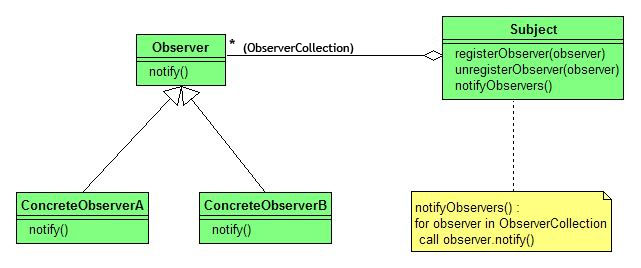

# 디자인 패턴 - 옵저버 패턴(Observer Pattern)

## 개념

- **종류:** 행위 패턴
- **정의:** 객체의 상태 변화를 관찰하는 관찰자(Observer)들에게 자동으로 알림을 보내는 패턴
- **활용**
  - 한 객체의 상태 변화가 다른 객체들에게 자동으로 통지되어야 할 때
  - 느슨한 결합으로 객체 간 의존성을 관리하고 싶을 때
  - 이벤트 기반 시스템을 구현할 때

## 구조

| 역할                | 설명                                                                                                                     |
| ------------------- | ------------------------------------------------------------------------------------------------------------------------ |
| Subject             | 관찰 대상 객체로, Observer 목록을 가지며, Observer를 등록/제거하고 상태 변화 시 각 Observer에게 알림을 보냄(notify) 정의 |
| Observer(Interface) | 관찰자 인터페이스로, 상태 변화를 받을 update 메소드를 정의                                                               |
| ConcreteObserver    | Observer를 구현한 구체적인 관찰자로, Subject의 상태 변화에 대한 처리 로직을 구현                                         |



## 장점 / 단점

- 장점: 객체 간 느슨한 결합, 실시간 정보 갱신, 새로운 관찰자 추가/삭제 쉬움(확장 용이)
- 단점: 디버깅 어려움, 성능 문제 발생 가능, Java Observable은 클래스라 다중 상속 불가

## 예시 코드

날씨 정보가 변경될 때마다 등록된 여러 디스플레이(휴대폰, 웹 등)에 자동으로 업데이트를 전달하기 위해 옵저버 패턴을 적용

```
📂 observer-example
 ┣ 📜 Observer.java             ← 관찰자 인터페이스
 ┣ 📜 WeatherStation.java       ← Subject (관찰 대상)
 ┣ 📜 PhoneDisplay.java         ← ConcreteObserver
 ┣ 📜 WebDisplay.java           ← ConcreteObserver
 ┗ 📜 Main.java                 ← 실행 예시
```

### Client

```java
public class Main {
    public static void main(String[] args) {
        WeatherStation station = new WeatherStation();

        Observer phoneDisplay = new PhoneDisplay();
        Observer webDisplay = new WebDisplay();

        station.addObserver(phoneDisplay);
        station.addObserver(webDisplay);

        station.setTemperature(25.5f);
        station.setTemperature(28.0f);

        station.removeObserver(webDisplay);
        station.setTemperature(30.0f);
    }
}
```

### Observer(Interface)

```java
public interface Observer {
    void notify(float temperature);
}
```

### ConcreteObserver

```java
public class PhoneDisplay implements Observer {
    @Override
    public void notify(float temperature) {
        System.out.println("[휴대폰] 현재 온도: " + temperature + "°C");
    }
}
```

```java
public class WebDisplay implements Observer {
    @Override
    public void notify(float temperature) {
        System.out.println("[웹 페이지] 현재 온도: " + temperature + "°C");
    }
}
```

### Subject

```java
import java.util.ArrayList;
import java.util.List;

public class WeatherStation {
    private List<Observer> observers = new ArrayList<>();
    private float temperature;

    public void registerObserver(Observer observer) {
        observers.add(observer);
    }

    public void unregisterObserver(Observer observer) {
        observers.remove(observer);
    }

    public void setTemperature(float temperature) {
        this.temperature = temperature;
        notifyObservers();
    }

    private void notifyObservers() {
        for (Observer observer : observers) {
            observer.notify(temperature);
        }
    }
}
```

## 정리 요약

- 객체의 상태 변화를 여러 관찰자에게 자동으로 알림
- 주체(Subject)와 관찰자(Observer) 간 느슨한 결합(Loose Coupling) 유지
- 새로운 관찰자 추가·제거가 용이하여 확장성과 유연성 높음
- 이벤트 기반 시스템, UI 갱신, 알림 시스템 등에 활용 적합
