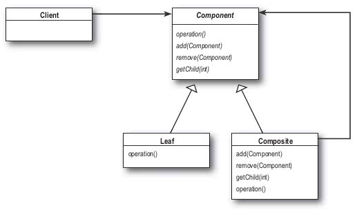

# 디자인 패턴 - 컴포지트 패턴(Composite Pattern)

## 개념

- **종류:** 구조 패턴
- **정의:** 객체들을 트리 구조로 구성하여, 개별 객체와 복합 객체를 동일하게 다룰 수 있게 하는 패턴
- **활용**
  - 계층 구조(트리 구조)로 객체를 표현할 때
  - 개별 객체와 복합 객체를 동일한 방식으로 처리해야 할 때
  - 예: 폴더-파일 구조, 조직도, UI 컴포넌트 트리

## 구조

| 역할                          | 설명                                                            |
| ----------------------------- | --------------------------------------------------------------- |
| Component(Interface/Abstract) | 공통 인터페이스를 정의하여, Leaf와 Composite를 동일하게 다룸    |
| Leaf                          | 실제 동작을 수행하는 개별 객체                                  |
| Composite                     | 여러 Component를 포함할 수 있는 복합 객체로, 자식 객체를 관리함 |



## 장점 / 단점

- **장점:** 계층 구조 표현 용이, 클라이언트가 단일/복합 객체 구분 없이 동일한 코드로 처리 가능
- **단점:** 설계 복잡도 증가, 트리 전체 순회 시 성능 이슈 가능

## 예시 코드

파일 시스템의 파일과 폴더를 동일한 방식으로 다루기 위해 컴포지트 패턴을 적용

폴더는 파일과 다른 폴더를 포함할 수 있지만, 파일은 파일이나 폴더를 포함할 수 없음

```
📂 composite-example
 ┣ 📜 FileSystemComponent.java   ← Component 인터페이스
 ┣ 📜 FileLeaf.java              ← Leaf
 ┣ 📜 FolderComposite.java       ← Composite
 ┗ 📜 Main.java                  ← 실행 예시
```

### Client

```java
public class Main {
    public static void main(String[] args) {
        FileSystemComponent file1 = new FileLeaf("resume.pdf");
        FileSystemComponent file2 = new FileLeaf("photo.png");
        FileSystemComponent folder = new FolderComposite("Documents");

        folder.add(file1);
        folder.add(file2);

        folder.showDetails();
    }
}
```

### Component(Interface)

```java
public interface FileSystemComponent {
    void showDetails();
}
```

### Leaf

```java
public class FileLeaf implements FileSystemComponent {
    private String name;

    public FileLeaf(String name) {
        this.name = name;
    }

    @Override
    public void showDetails() {
        System.out.println("📄 파일: " + name);
    }
}
```

### Composite

```java
import java.util.ArrayList;
import java.util.List;

public class FolderComposite implements FileSystemComponent {
    private String name;
    private List<FileSystemComponent> children = new ArrayList<>();

    public FolderComposite(String name) {
        this.name = name;
    }

    public void add(FileSystemComponent component) {
        children.add(component);
    }

    public void remove(FileSystemComponent component) {
        children.remove(component);
    }

    @Override
    public void showDetails() {
        System.out.println("📁 폴더: " + name);
        for (FileSystemComponent child : children) {
            child.showDetails();
        }
    }
}
```

## 정리 요약

- 객체를 트리 구조로 구성해 단일/복합 객체를 동일하게 처리
- 구조적 유연성 향상
- 복잡한 계층 구조를 단순하게 관리 가능
